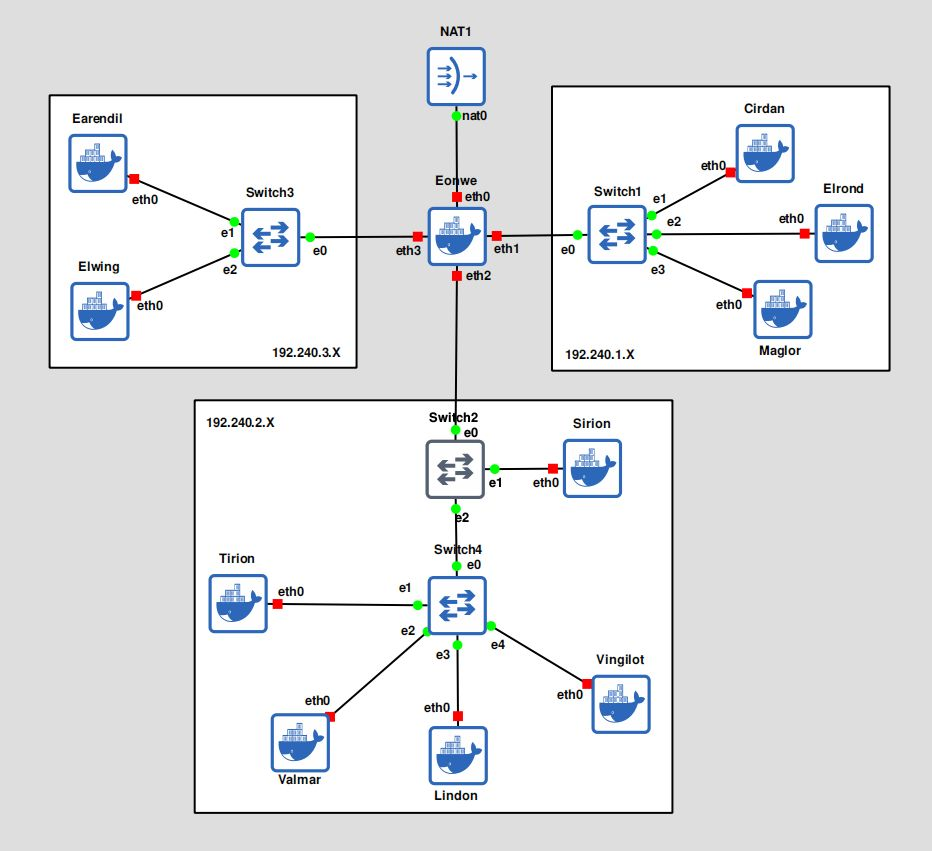

# Jarkom-Modul-2-2025-K58

| Nama                        | NRP        |
| --------------------------- | ---------- |
| Thio Billy Amansyah         | 5027231007 |
| Ivan Syarifuddin            | 5027241045 | 

## No.1
**SOAL:** Di tepi Beleriand yang porak-poranda, Eonwe merentangkan tiga jalur: Barat untuk Earendil dan Elwing, Timur untuk Círdan, Elrond, Maglor, serta pelabuhan DMZ bagi Sirion, Tirion, Valmar, Lindon, Vingilot. Tetapkan alamat dan default gateway tiap tokoh sesuai glosarium yang sudah diberikan.

**PENJELASAN:** Buat topologi LAN seperti gambar di bawah ini:



Bagi client, tulis konfigurasi sbg berikut:

```
# Static config for eth0
auto eth0
iface eth0 inet static
	address 192.240.3.2		# IP client
	netmask 255.255.255.0
	gateway 192.240.3.1		# IP gateway LAN 3
```

Bagi router, tulis konfigurasi sbg berikut:

```
# Static config for eth1
auto eth1
iface eth1 inet static
	address 192.240.1.1		# IP gateway LAN 1
	netmask 255.255.255.0


# Static config for eth2
auto eth2
iface eth2 inet static
	address 192.240.2.1		# IP gateway LAN 2
	netmask 255.255.255.0

# Static config for eth3
auto eth3
iface eth3 inet static
	address 192.240.3.1		# IP gateway LAN 3
	netmask 255.255.255.0
```

## No.2
**SOAL:** Angin dari luar mulai berhembus ketika Eonwe membuka jalan ke awan NAT. Pastikan jalur WAN di router aktif dan NAT meneruskan trafik keluar bagi seluruh alamat internal sehingga host di dalam dapat mencapai layanan di luar menggunakan IP address.

**PENJELASAN:** Hubungkan router dengan node NAT: 

Berikan router sebuah IP berdasarkan DHCP server pada iface `eth0`; 

```
# DHCP config for eth0
auto eth0
iface eth0 inet dhcp
```

Jalankan iptables seperti berikut untuk menjadikan router sebagai NAT bagi client-clientnya: `iptables -t nat -A POSTROUTING -o eth0 -j MASQUERADE -s 192.240.0.0/16`

## No.3
**SOAL:** Kabar dari Barat menyapa Timur. Pastikan kelima klien dapat saling berkomunikasi lintas jalur (routing internal via Eonwe berfungsi), lalu pastikan setiap host non-router menambahkan resolver 192.168.122.1 saat interfacenya aktif agar akses paket dari internet tersedia sejak awal.

**PENJELASAN:** Tambahkan konfigurasi berikut pada setiap client: 

```
# Static config for eth0
auto eth0
iface eth0 inet static
	address 192.240.2.3
	netmask 255.255.255.0
	gateway 192.240.2.1
	up echo nameserver 192.168.122.1 > /etc/resolv.conf
```

## No.4
**SOAL:** Para penjaga nama naik ke menara, di Tirion (ns1/master) bangun zona <xxxx>.com sebagai authoritative dengan SOA yang menunjuk ke ns1.<xxxx>.com dan catatan NS untuk ns1.<xxxx>.com dan ns2.<xxxx>.com. Buat A record untuk ns1.<xxxx>.com dan ns2.<xxxx>.com yang mengarah ke alamat Tirion dan Valmar sesuai glosarium, serta A record apex <xxxx>.com yang mengarah ke alamat Sirion (front door), aktifkan notify dan allow-transfer ke Valmar, set forwarders ke 192.168.122.1. Di Valmar (ns2/slave) tarik zona <xxxx>.com dari Tirion dan pastikan menjawab authoritative pada seluruh host non-router ubah urutan resolver menjadi IP dari ns1.<xxxx>.com → ns2.<xxxx>.com → 192.168.122.1. Verifikasi query ke apex dan hostname layanan dalam zona dijawab melalui ns1/ns2.

**PENJELASAN:** Bikin zonefile "k58.com" pada Tirion (ns1/master) dengan..

- SOAnya ns1.k58.com
- NSnya ns1.k58.com and ns2.k58.com
- A record ns1.k58.com and ns2.k58.com nunjuk ke dns server masing-masing
- A record k58.com nunjuk ke Sirion

```
$TTL            3h

@               IN      SOA     n1.k58.com.     admin.k58.net. (
                        1       ; Serial
                        3h      ; Refresh
                        1h      ; Retry
                        1w      ; Expire
                        1h      ; Negative caching TTL
                        )

@               IN      NS      ns1.k58.com. 
@               IN      NS      ns2.k58.com. 

ns1             IN      A       192.240.2.3 ; Tirion
ns2             IN      A       192.240.2.4 ; Valmar
@               IN      A       192.240.2.2 ; Sirion
```

Konfigurasi master dns server pada node Tirion (ns1/master) dg menambahkan `/etc/bind/named.conf.local`:

```
zone "k58.com" {
        type master;
        notify yes;
        allow-transfer { 192.240.2.4; };	// <---
        also-notify { 192.240.2.4; };		// <---
        file "/etc/bind/ns1.k58.com";
};
```

Menetapkan forwarders ke `192.168.122.1` dg menulis `/etc/bind/named.conf.options` pada Tirion (ns1/master)..

```
options {
        directory "/var/cache/bind";
        listen-on port 53 { localhost; 192.240.0.0/16; };
        allow-query { localhost; 192.240.0.0/16; };
        forwarders { 192.168.122.1; };		// <---
};
```

Konfigurasi slave dns pada Valmar (ns2/slave) dg menulis zonefile..

```
zone "k58.com" {
        type slave;
        masters { 192.240.2.3; }; // IP Tirion/master
        file "/var/cache/bind/ns2.k58.com";
};
```

Menetapkan `/etc/resolv.conf` seperti berikut pada setiap node..

```
nameserver 192.240.2.3		// ns1/master
nameserver 192.240.2.4		// ns2/slave
nameserver 192.168.122.1
```

## No.5
**SOAL:** “Nama memberi arah,” kata Eonwe. Namai semua tokoh (hostname) sesuai glosarium, eonwe, earendil, elwing, cirdan, elrond, maglor, sirion, tirion, valmar, lindon, vingilot, dan verifikasi bahwa setiap host mengenali dan menggunakan hostname tersebut secara system-wide. Buat setiap domain untuk masing masing node sesuai dengan namanya (contoh: eru.<xxxx>.com) dan assign IP masing-masing juga. Lakukan pengecualian untuk node yang bertanggung jawab atas ns1 dan ns2.

**PENJELASAN:** Tetapkan A record pada setiap client dengan subdomain yang sesuai dengan nama tiap client (eg. lindon dengan lindon.k58.com). Tambahkan ini pada zonefile milik Tirion (ns1/master):

```
...
eonwe           IN      A       192.240.1.1
eonwe           IN      A       192.240.2.1
eonwe           IN      A       192.240.3.1

cirdan          IN      A       192.240.1.2
elrond          IN      A       192.240.1.3
Maglor          IN      A       192.240.1.4

@               IN      A       192.240.2.2
sirion          IN      A       192.240.2.2
ns1             IN      A       192.240.2.3
ns2             IN      A       192.240.2.4
lindon          IN      A       192.240.2.5
vingilot        IN      A       192.240.2.6

earendil        IN      A       192.240.2.2
elwing          IN      A       192.240.2.3
```

## No.6
**SOAL:** Lonceng Valmar berdentang mengikuti irama Tirion. Pastikan zone transfer berjalan, Pastikan Valmar (ns2) telah menerima salinan zona terbaru dari Tirion (ns1). Nilai serial SOA di keduanya harus sama

**PENJELASAN:** Setelah merubah zonefile pada nomor sebelum. Jangan lupa ubah serial pada jadi berbeda dari angka sebelum (idealnya n+1). Lalu restart daemon.

```
...
@               IN      SOA     n1.k58.com.     admin.k58.net. (
                        2       ; Serial
                        3h      ; Refresh
...
```

## No.7
**SOAL:** Peta kota dan pelabuhan dilukis. Sirion sebagai gerbang, Lindon sebagai web statis, Vingilot sebagai web dinamis. Tambahkan pada zona <xxxx>.com A record untuk sirion.<xxxx>.com (IP Sirion), lindon.<xxxx>.com (IP Lindon), dan
vingilot.<xxxx>.com (IP Vingilot). Tetapkan CNAME :

- www.<xxxx>.com → sirion.<xxxx>.com ,
- static.<xxxx>.com → lindon.<xxxx>.com, dan
- app.<xxxx>.com → vingilot.<xxxx>.com.

Verifikasi dari dua klien berbeda bahwa seluruh hostname tersebut ter-resolve ke tujuan yang benar dan konsisten.

**PENJELASAN:** Tambahkan CNAME record dan jgn lupa incerment serial pada SOA record. Lalu restart daemon.
```
...
@               IN      SOA     n1.k58.com.     admin.k58.net. (
                        3       ; 		Serial
                        3h      ; Refresh
                        1h      ; Retry
                        1w      ; Expire
                        1h      ; Negative caching TTL
                        )
...
www             IN      CNAME   sirion		; <---
static          IN      CNAME   lindon		; <---
app             IN      CNAME   vingilot	; <---
...
```

## No.8
**SOAL:** Setiap jejak harus bisa diikuti. Di Tirion (ns1) deklarasikan satu reverse zone untuk segmen DMZ tempat Sirion, Lindon, Vingilot berada. Di Valmar (ns2) tarik reverse zone tersebut sebagai slave, isi PTR untuk ketiga hostname itu agar pencarian balik IP address mengembalikan hostname yang benar, lalu pastikan query reverse untuk
alamat Sirion, Lindon, Vingilot dijawab authoritative.

**PENJELASAN:** Tambahkan zone pada `named.conf.local` sbg berikut..

```
...
zone "2.240.192.in-addr.arpa" {
        type master;
        file "/etc/bind/rns1.k58.com";

        notify yes;
        allow-transfer { 192.240.2.4; };
        also-notify { 192.240.2.4; };
};
```

Isi PTR record untuk ketiga hostname pada zonefile yang baru:

```
$TTL            3h

@       IN      SOA     n1.k58.com.     admin.k58.net. (
                        1       ; Serial
                        3h      ; Refresh
                        1h      ; Retry
                        1w      ; Expire
                        1h      ; Negative caching TTL
                        )

@       IN      NS      ns1.k58.com.
2       IN      PTR     sirion.k58.com.
5       IN      PTR     lindon.k58.com.
6       IN      PTR     vingilot.k58.com.	
```

## No.9
**SOAL:** Lampion Lindon dinyalakan. Jalankan web statis pada hostname static.<xxxx>.com dan buka folder arsip /annals/ dengan autoindex (directory listing) sehingga isinya dapat ditelusuri. Akses harus dilakukan melalui hostname, bukan IP.

**PENJELASAN:** Install dan jalankan sebuah web server (eg. lighttpd) serta TUI web browser, lalu buatkan directory `/annals` pada `/var/www/html`:
```
apt update -y && apt install lighttpd w3m -y
service lighttpd start
mkdir /var/www/html/annals
```

Tambahkan `server.dir-listing = "enable"` pada `/etc/lighttpd/lighttpd.conf`:
```
...
server.document-root        = "/var/www/html"
server.dir-listing          = "enable"	# <---
server.upload-dirs          = ( "/var/cache/lighttpd/uploads" )
server.errorlog             = "/var/log/lighttpd/error.log"
...
```

Dapat dites dengan mengakses `static.k58.com` ketika server dns Tirion nyala: `w3m static.k58.com`
